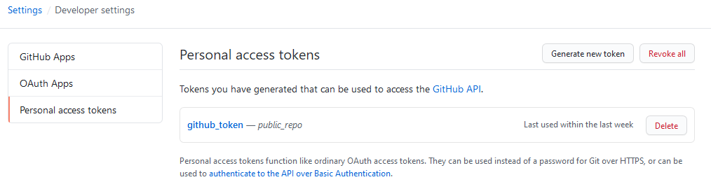

## Herramientas Utilizadas

📄 [Diseño hecho en webflow ](https://smart-machines.webflow.io/)

💻 [Website en progreso](https://lab-smart-machines-github-io.vercel.app/)

🏁 [Iconos FontAwesome](https://fontawesome.com/)

🙂 [Ilustraciones unDraw](https://undraw.co/)

Usamos NextJS, GraphQL y Vercel para desplegar.

# Hosting con Vercel (Traducción de la [Introduccion](https://vercel.com/docs/introduction))

## Como usar 💻

<summary><b>Descargar Node.js</b></summary>
Node.js es un entorno de ejecución para JavaScript.
Descargarlo : https://nodejs.org/es/

<summary><b>Clonar el repositorio e Instalar</b></summary>

`git clone https://github.com/LAB-Smart-Machines/lab-smart-machines.github.io.git`

### <b> Instalar todo los packages</b>

Instalar packages necesarios

```bash
npm install
```

### <b>Variables </b>

Se requiere un token de acceso personal para autenticar y acceder el contenido del usuario. Si no tienes el token, se necesita crear uno nuevo. En este proyecto, usamos un token de Github que nos da permiso ver nuestros proyectos.



Lee mas [aquí](https://help.github.com/es/github/authenticating-to-github/creating-a-personal-access-token-for-the-command-line).

Despues de haber copiado el nuevo token, no te olvides de ponerlo en tu archivo `.env` en el directorio raíz de su proyecto. Agregar variables específicas en forma de `NOMBRE = VALOR`.
Es requerido tener `LSM_GITHUB_TOKEN` en `.env`:

```javascript
LSM_GITHUB_TOKEN = xxxxxxxxxxxxxxxxxxxxxxx;
```

❗ _Mantener seguro tu cuenta y tus datos. Como precaución de seguridad, archivos `.env` deben ser ignorados e indicarle a Git que no lo quieres compartir. Tienen que estar añadidos a tu archivo [`.gitignore`](https://docs.github.com/es/github/using-git/ignoring-files)_

❗ **_Advertencia: Preserva tus tokens de la misma manera que tus contraseñas y no se las reveles a nadie. Cuando trabajes con un API, usa tokens como variables del entorno en lugar de codificarlos de forma rígida en tus programas._**

## Importante 📌

- Si el token de Github se ha cambiado, tambien se necesita actualizar el valor en [Vercel](https://vercel.com/docs/build-step#environment-variables) con el mismo nombre `LSM_GITHUB_TOKEN`.

## Como desplegar a Vercel? 🚀

Cada vez que el codigo se actualiza en el branch `master`, vercel deberia desplegar actulizar tambien.

Entra a la pagina de [Vercel](https://vercel.com/), inicia la sesión que debe estar conectada al Github [`lab-smart-machines`](https://vercel.com/lab-smart-machines/lab-smart-machines-github-io).

### [Como edito la pagina principal?](/EDITAR.md) ✏

### [Como uso Markdown?](/MARKDOWN.md) 📃
